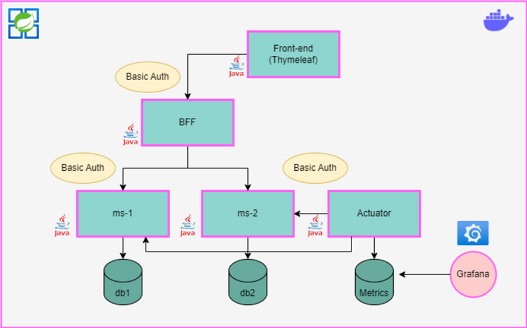

# Documento de definición de arquitectura

## 1. Pautas para la entrega del trabajo práctico final

### a) Se entrega:
#### a.	Proyecto completo de Netbeans comprimido en .zip (incluye Thymeleaf, WebClient, dos microservicios y el Actuator).
#### b.	Archivos compilados .jar y .war para ejecutar.
#### c.	Proyecto Postman con los servicios configurados para probar funcionamiento del BFF.
####    La entrega debe estar en una carpeta llamada nombreAlumno_sistemasactivos.zip y luego debe ser cargada a la tarea asignada en Classroom.
### b) El plazo de entrega es hasta el jueves 15/02/24 23:59 hrs.
### c) Los microservicios deben ser construidos en Java Springboot.
### d) Debe implementarse todo lo visto en clase (incluido el paginado) y agregar toda lógica que se considere necesaria para obtener un producto con la mejor terminación.
### e) El Thymeleaf debe poder realizar todas las consultas HTTP: GET, POST, PUT y DELETE.
### f) El BFF debe realizar una composición de datos entre los dos microservicios.
### g) Es opcional entregar el proyecto Dockerizado.
### h) Es opcional la implementación de bajas lógicas para el DELETE.
### i) Es opcional la implementación de Grafana (en caso de implementarlo adjuntar las capturas del Dashboard realizado con la herramienta).
### j) La base de datos a utilizar debe ser MySQL o MariaDB. Debemos usar tres schemas diferentes: db1 para el primer microservicio, db2 para el segundo y metrics para el proyecto Actuator.
### k) Cada microservicio deberá contar con la documentación correspondiente (Swagger de Open API OAS3).
### l) La solución debe ser gestionada con Maven.
### m) El producto debe ser entregado para un entorno productivo.
### n) La API debe ser del tipo RESTful estándar OPEN API OAS2 o 3.
### o) Deberá usar la especificación JPA en Hibernate para la integración con la capa de datos desde la solución SpringBoot (por rendimiento también se permite utilización de JDBC para algún método específico).
### p) Los microservicios, incluído el BFF, deben contar con Basic Auth.
### q) Se deberá usar la versión de Java 17, SpringBoot 3.0.2 o 3.0.3 y Spring Framework 6.0.5.

## 2. Diagrama de arquitectura de la solución

### Dada la arquitectura, se solicita únicamente desarrollar todos los servicios y dbs que están en celeste/azul (incluye Basic Auth), siendo opcional Grafana y Docker.



## Ejecución en local

### Pre-requisitos
- [Docker](https://www.docker.com)

### 1. Clonar el repositorio:
 ```bash
 git clone https://github.com/martinSaav/SA-TP2-microservices.git
 ```
### 2. Entrar a la raiz del proyecto
 ```bash
cd SA-TP2-microservices
 ```
### 3. Levantar todos los microservicios con docker compose:
 ```bash
docker-compose up --build
 ```
